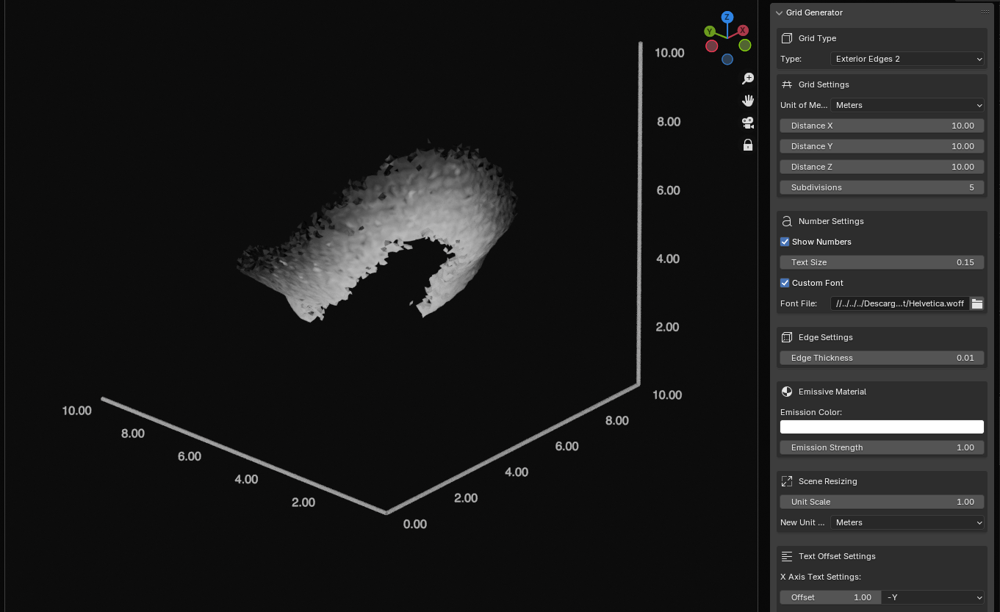

# SciBlend: Grid Generator for Blender

This script is an add-on for Blender 4.2 that allows users to create customizable 3D grids with numbered nodes and adjustable edges. It's a powerful tool for scientific visualization, data representation, and spatial analysis in three-dimensional space.

## Requirements

Before installing Blender and the add-on, ensure that you meet the following requirements:

1. **Operating System**: 
    - Any OS that supports Blender 4.2 (Windows, macOS, Linux)
  
2. **Blender**:
    - Blender 4.2 or higher

3. **Python**:
    - Python 3.11 (bundled with Blender 4.2)

## Features

- **Customizable 3D Grid**: Generate a 3D grid structure with adjustable dimensions and subdivisions.
- **Numbered Nodes**: Option to display coordinate numbers at each grid point.
- **Adjustable Edges**: Create visible edges with customizable thickness.
- **Emissive Materials**: Apply emissive materials to make the grid stand out in renders.
- **Real-time Updates**: Dynamically update text and edge sizes without regenerating the entire structure.

## Install the Add-on

1. **Package the Script**:
    - Place the provided script files into a folder named `GridGenerator`.

2. **Install the Add-on in Blender**:
    - Open Blender and go to `Edit > Preferences > Add-ons`.
    - Click on `Install...` and select the `GridGenerator` folder.
    - Enable the add-on by checking the box next to `Grid Generator`.

3. **Using the Add-on**:
    - Access the add-on from the `View3D` panel under the `Grid Generator` tab.
    - Configure your grid and add it to your composition.

## Usage

Once the add-on is installed and enabled, you can use it to generate and customize 3D grids in Blender:

1. **Accessing the Add-on Panel**:
   - Open Blender and switch to the `3D Viewport`.
   - In the right sidebar, locate the `Tools` tab.
   - Find the `Grid Generator` panel.

2. **Configuring Your 3D Grid**:
   - Set the `Unit of Measure` (mm, cm, dm, or m).
   - Adjust the `Distance` in X, Y, and Z directions.
   - Set the number of `Subdivisions`.
   - Toggle `Show Numbers` to display coordinate values at each point.
   - Adjust `Text Size` and `Edge Size` as needed.

3. **Generating the 3D Grid**:
   - Click `Generate Grid Numbers` to create the basic structure.
   - Use `Generate Edges with Volume` to add visible edges to the grid.

4. **Customizing Appearance**:
   - Adjust `Text Size` and `Edge Size` at any time using the respective update buttons.
   - Set the `Emission Color` and `Emission Strength` for the emissive material.
   - Click `Apply Emissive Material` to make the grid glow.

5. **Working with the Result**:
   - The generated 3D grid will be placed in your scene.
   - You can move, rotate, or scale the entire structure as needed.
   - Use Blender's built-in tools to further customize or animate the grid.

## Tips for Best Results

- For precise measurements, ensure your Blender units are set correctly in the scene properties.
- Experiment with different subdivision levels to find the right balance between detail and performance.
- Use the emissive material option to make your grid stand out in dark or complex scenes.
- Combine this add-on with Blender's animation tools to create dynamic coordinate system visualizations.

## Contributing

Contributions are welcome! Feel free to open issues or submit pull requests to improve this project.

